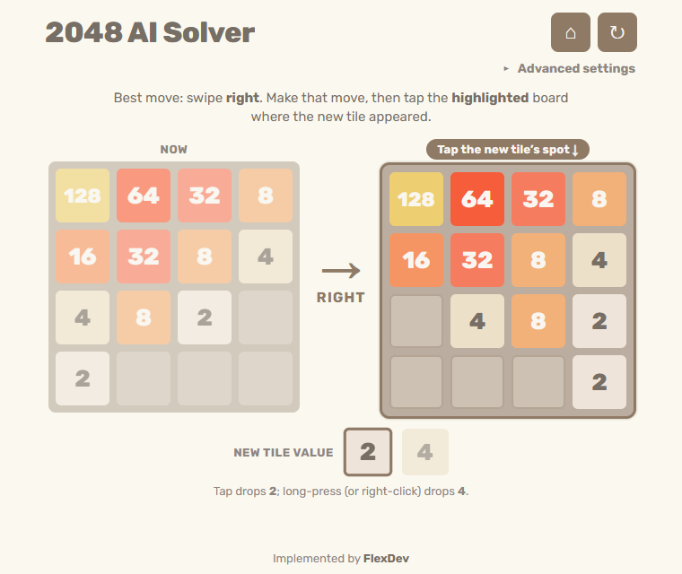

# 2048 AI Solver

**Try it: https://2048-solver-ai.vercel.app**

A free AI move advisor for the 2048 game you're already playing, on your phone or
another site. Enter your board once and it tells you the best swipe. Make that
swipe in your game, tap in the one new tile that appeared, and it suggests the
next move. That's one tap per move, not re-entering the whole board every time.



## How it works

- **Expectimax search.** For each possible swipe, the AI looks several moves
  ahead and averages over where the next tile can spawn (a 2 with 90% chance, a
  4 with 10%).
- **nneonneo's heuristic.** Positions are scored with a TypeScript port of the
  evaluation from [nneonneo/2048-ai](https://github.com/nneonneo/2048-ai). It
  rewards rows and columns in descending order, empty cells and available
  merges, and penalises boards holding many large unmerged tiles.
- **Always quick.** Search depth adapts to how crowded the board is, very
  unlikely branches are skipped, and a node budget caps the work. The search
  runs in a Web Worker, so the page stays responsive.
- **Runs in your browser.** There's no server, no account and no ads. Your
  board never leaves your device. The site counts page views with Vercel Web
  Analytics, which doesn't use cookies.

By default the AI plays to 1024 and avoids making 2048, because many versions
end the game when a 2048 appears. You can raise or remove that limit under
**Advanced settings**.

## Development

Requires Node.js 20 or later.

```bash
npm install
npm run dev        # http://localhost:3000
npm test           # vitest unit tests (game rules + solver)
npm run typecheck
npm run build
```

Next.js 16, React 19 and TypeScript, with no backend.

## Deployment

Vercel's GitHub integration deploys every push to `main` to production and
every other branch to a preview URL. `vercel.json` runs the test suite before
`next build`, so a failing test fails the deploy and production stays on the
last good build. Day-to-day work happens on `dev` and reaches `main` through
pull requests.

## Found a bug?

[Open a bug report](https://github.com/YaromyrS/2048-solver/issues/new?template=bug_report.yml).
If the AI suggested a bad move, include the board so it can be reproduced.

## Credits

The evaluation heuristic and its weights come from
[nneonneo/2048-ai](https://github.com/nneonneo/2048-ai). Built by FlexDev.
